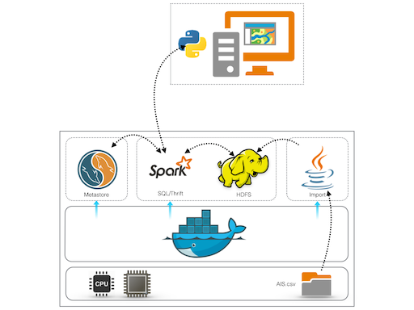
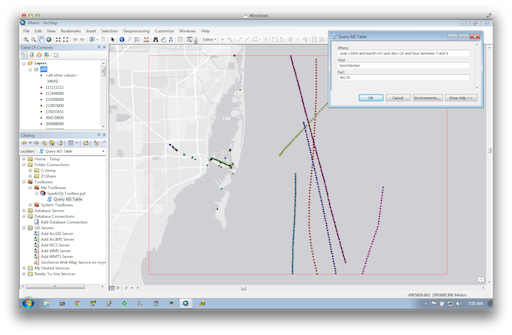

# Import, Partition and Query AIS Data using SparkSQL

This [Docker](https://www.docker.com/) based project is composed of multiple containers to enable the import, partition and query of
[AIS](http://www.navcen.uscg.gov/?pageName=AISmain) data.  The original CSV AIS data is parsed and based on the broadcast timestamp,
the records are placed into multiple [HDFS](http://hortonworks.com/hadoop/hdfs/) paths in the form of `hdfs:///yyyy/mm/dd/ais.csv`,
where `yyyy` is the year, `mm` is the month and `dd` is the day. HDFS is served from its own docker container.
An external [Hive](https://hive.apache.org/) table is mapped onto these HDFS paths, in such that the AIS records can queried using [HQL](https://cwiki.apache.org/confluence/display/Hive/LanguageManual+Select).
The latter is executed in same HDFS container using [Spark SQL](https://spark.apache.org/sql/) and is exposed as a [Thrift Hive Server 2](https://cwiki.apache.org/confluence/display/Hive/HiveServer2+Thrift+API).
The Hive [metastore](https://cwiki.apache.org/confluence/display/Hive/AdminManual+MetastoreAdmin) is housed in a [MySQL](http://www.mysql.com) database and is served from its own container.
The ephemeral import process is performed in another container that reads the data from a volume mapped onto the host file system. The records are parsed
and partitioned based on their data/time field and writen to HDFS using a multiple output writer.
Finally, [ArcMap](http://www.esri.com/software/arcgis/arcgis-for-desktop) is used to query and render the data through an [ArcPy toolbox](http://resources.arcgis.com/en/help/main/10.1/index.html#//001500000022000000)
using the Hive Server 2 thrift protocol.



I'm using [boot2docker](http://boot2docker.io/) on my Mac to launch this project.

_Tip_: You might want to increase the memory and storage space of the boot2docker VM for a "speedier" experience as follows:

```shell
boot2docker init -m 8192 -s 32768
```

## Start MySQL Docker Container

[A MySQL database](http://www.mysql.com) is used to store and serve the Hive [metastore](https://cwiki.apache.org/confluence/display/Hive/AdminManual+MetastoreAdmin).

```shell
docker run\
 --name mysql\
 -e MYSQL_ROOT_PASSWORD=root\
 -e MYSQL_DATABASE=metastore_db\
 -e MYSQL_USER=hiveuser\
 -e MYSQL_PASSWORD=hivepassword\
 -d -p 3306:3306\
 mysql
```

Here, we started a detached (`-d`) docker container named `mysql` that exposes its internal `3306` port as `3306` externally.
In addition, values were assigned to predefined environment variables that are used by the [MySQL docker](https://registry.hub.docker.com/_/mysql/) bootstrapping and initialization process.

## SparkSQL on Docker

The `docker` folder contains a set of files to build and run SparkSQL on Docker.
The build process downloads Spark version `1.2.1` and downloads [Connector/J](http://dev.mysql.com/downloads/connector/j/).
In addition, it places in the image a set of template files and startup shell scripts.

### Build the image

```shell
docker build -t mraad/spark .
```

### Run the image

```shell
docker run\
 --name spark\
 --link mysql:mysql\
 -i -t -P\
 mraad/spark /bin/bash
```

This starts an interactive docker container named `spark` that is linked to the `mysql` container
and [exposes](https://docs.docker.com/userguide/dockerlinks/) all the ports defined in the `Dockerfile`.

### Start HDFS, YARN, HiveServer2

```shell
/etc/start-all.sh
```

### Stop HiveServer2, YARN, HDFS

```shell
/etc/stop-all.sh
```

## Import AIS data to HDFS

A sample AIS data can be download from [MarineCadastre.gov](http://marinecadastre.gov/ais/).
I converted the broadcast data into a CSV formatted file and placed a zipped copy in the `data` folder.

### Build the import job

```shell
mvn package
```

### Run the import job

```
cd data && unzip ais.csv && cd -
docker run --rm\
 --link spark:hdfs\
 -v $(pwd)/data:/data\
 -v $(pwd)/target:/opt/target\
 dockerfile/java:oracle-java7\
 java -server -Xms1g -Xmx4g -XX:+UseCompressedOops -jar /opt/target/spark-ais-multi-1.0.jar
```

This starts a docker container with an `oracle-java7` image that is linked to the `spark` container with the `hdfs` alias
and mounts the `data` folder in the current working directory as `/data` in the container and mounts the `target` folder
in the current working directory as `/opt` to execute the import job as the main class in `spark-ais-multi-1.0.jar`.

The import job reads and parses the records in `/data/ais.csv` and partitions each record based on its data/time field to
be written onto HDFS paths in the form `hdfs:///ais/yyyy/mm/dd/ais.csv`.

## Register the AIS Hive table

The partitioned HDFS files need to be mapped to an external hive table in such that it can be queried using SparkSQL.

In the spark container, execute the follow command:

```
/etc/create-table.sh
```

This script creates a temporary file `/tmp/tmp.hql` that defines an external table named `ais` and its fields.

```sql
create external table if not exists ais (
mmsi string,
lon double,
lat double,
heading int,
hour int,
zulu string
) partitioned by (year int, month int, day int)
row format delimited
fields terminated by ','
lines terminated by '\n'
stored as textfile;
```

In addition, it iterates over all the folders in the HDFS `/ais` folder and appends HQL DDLs such as:

```sql
...
alter table ais add if not exists partition (year=2009,month=01,day=03) location 'hdfs://172.17.0.5:9000/ais/2009/01/03';
...
```

## Query the AIS Hive table using SparkSQL

Use the following to start an interactive HQL session with the newly registered `ais` table:

```shell
/etc/spark-sql.sh
```

Here are some queries:

```sql
cache table ais;
```


```sql
select * from ais where year=2009 and month=01 and day=20 limit 20;
```

```sql
select hour,count(hour) from ais group by hour;
```

## View AIS data in ArcMap

ArcMap is extended with an ArcPy based toolbox to query the AIS table using the HiveServer2 thrift protocol.
To ensure that duplex communication, the [pyhs2](https://github.com/BradRuderman/pyhs2) python package need to be installed using [pip](https://pip.pypa.io/en/latest/installing.html).

First, download from [http://www.lfd.uci.edu/~gohlke/pythonlibs/](http://www.lfd.uci.edu/~gohlke/pythonlibs/) a pre-compiled 32 Bit
version of the Simple Authentication and Security Layer (SASL) library for Python27 and proceed with the installation as follows:


```shell
pip install sasl-0.1.3-cp27-none-win32.whl
pip install pyhs2 --upgrade
```

To test the query protocol from end to end, you need to first determine the exposed port number of the HiveServer2 `10000` port using:

```shell
docker port spark | sort -t / -n
```

A sample output will be as follows:

```
...
10000/tcp -> 0.0.0.0:49179
...
```

So, in my case port `10000` is exposed as port `49179` through my boot2docker host. And I can determine my boot2docker
host address using `boot2docker ip` CLI.

```shell
Mansour-mac:docker mraad_admin$ boot2docker ip
192.168.59.103
```

Using the above information, we can run a quick Python script to test an end-to-end query:

```python
import pyhs2

with pyhs2.connect(host='192.168.59.103',
                   port=49179,
                   authMechanism="NOSASL",
                   user='root',
                   password='root',
                   database='default') as conn:
    with conn.cursor() as cur:
        cur.execute("select * from ais where year=2009 and month=01 and day=20 limit 10")
        print cur.getSchema()
        for row in cur.fetch():
            print row
        cur.close()
    conn.close()
```

Copy `src/main/python/SparkSQLToolbox.pyt` into a location that is visible to ArcCatalog and execute it to query AIS data.



## References

- [Changing Default metastore [derby] of Hive to MySQL](https://archanaschangale.wordpress.com/2013/09/05/changing-default-metastore-derby-of-hive-to-mysql/)
- [Apache Spark On Docker](https://github.com/sequenceiq/docker-spark)

## Miscellaneous Notes

### Install MySQL Using Homebrew

```shell
sudo brew install mysql
sudo mysql_install_db --verbose --user=`whoami` --basedir="$(brew --prefix mysql)" --datadir=/usr/local/var/mysql --tmpdir=/tmp --explicit_defaults_for_timestamp
sudo chown -R mysql /usr/local/var/mysql/
sudo rm /usr/local/var/mysql/*.err
sudo mysql.server start
sudo mysql_secure_installation
```

```sql
ALTER DATABASE metastore_db character set latin1;
```
